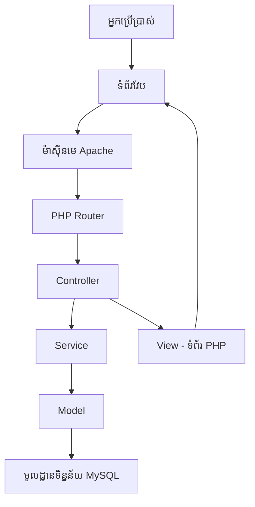
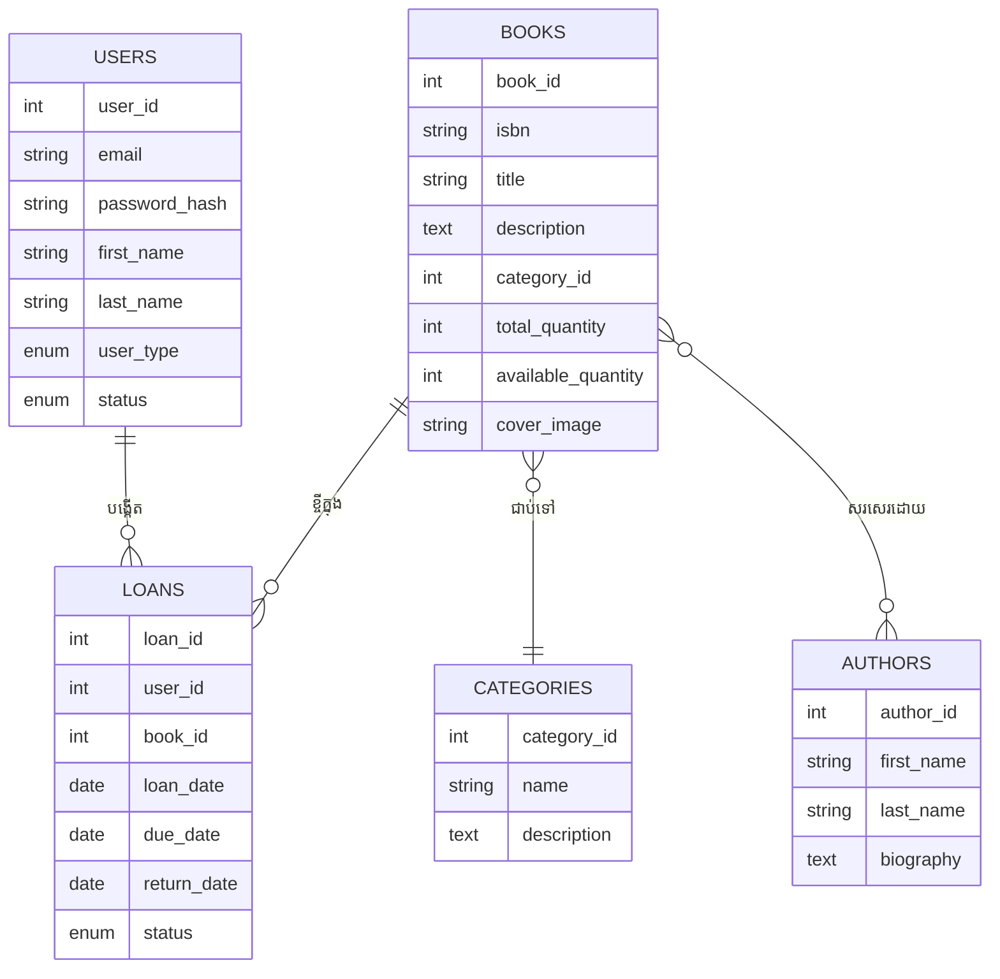
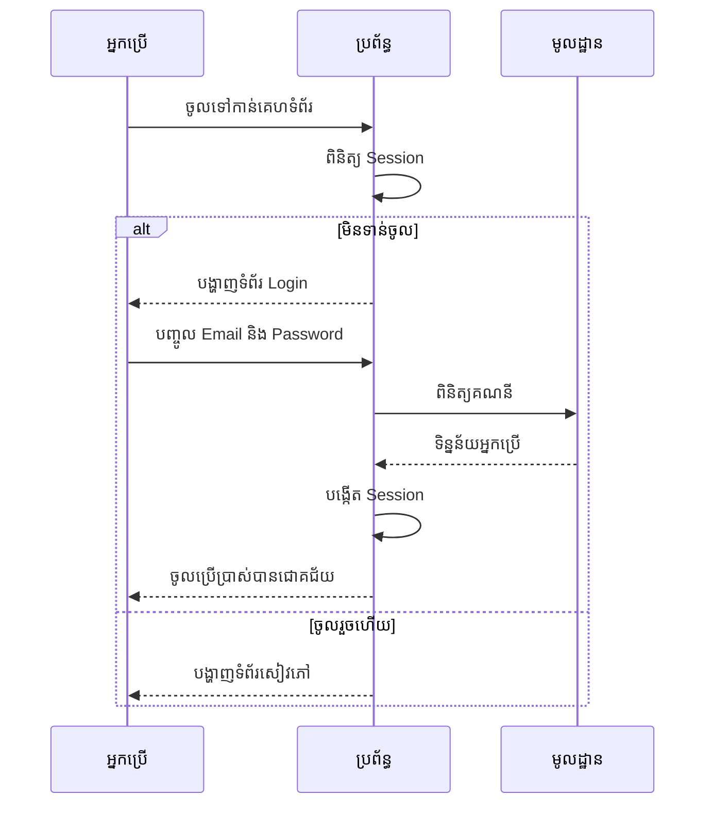
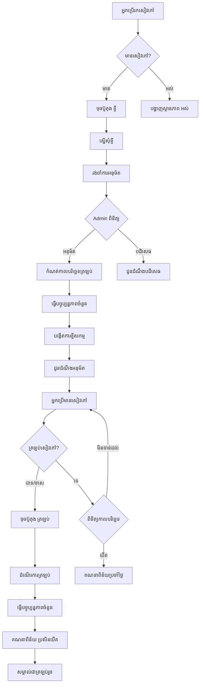
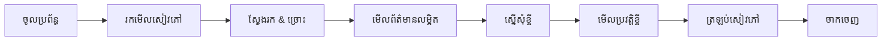
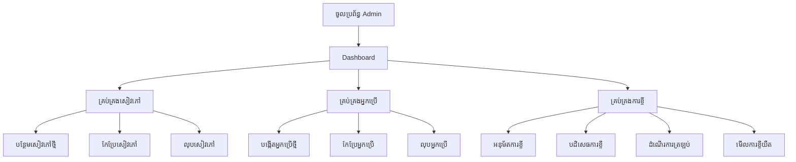
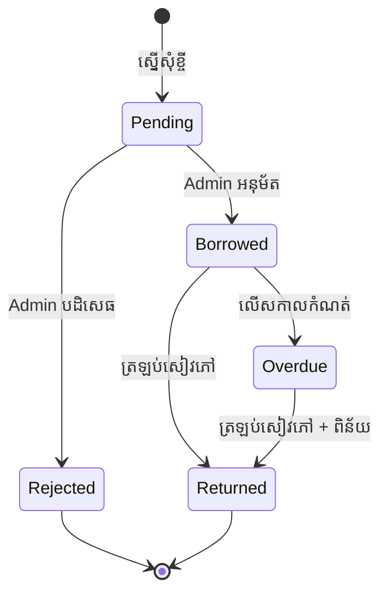
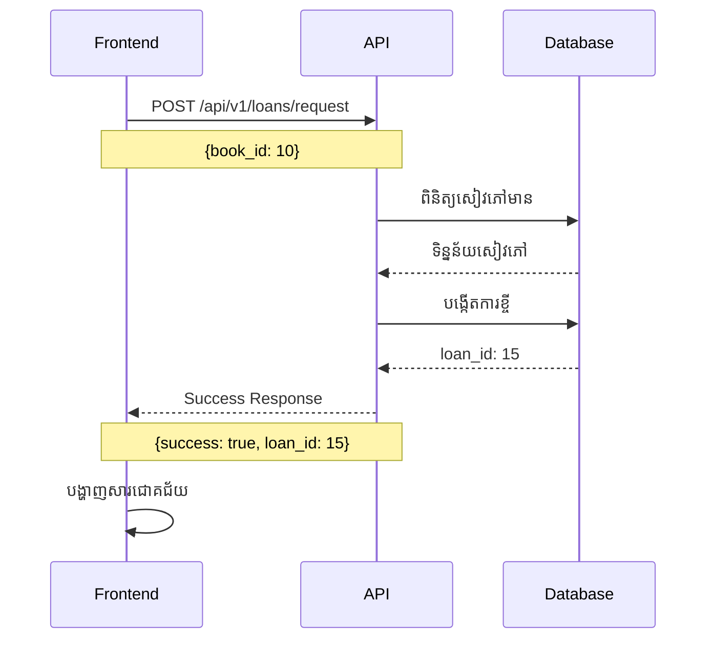
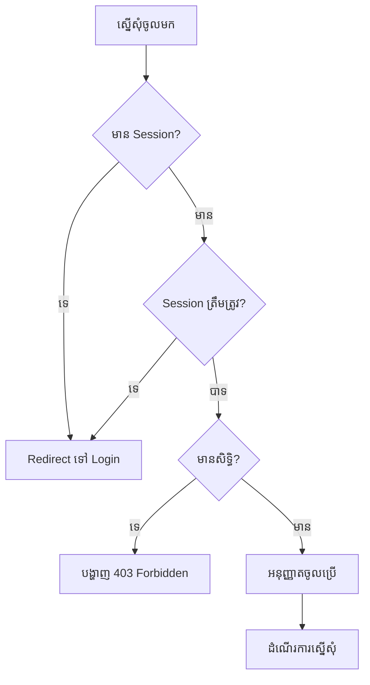

# មគ្គុទ្ទេសក៍ប្រើប្រាស់ប្រព័ន្ធបណ្ណាល័យ KHLIBRARY

## ស្ថាបត្យកម្មប្រព័ន្ធ

## ទំនាក់ទំនងតារាងទិន្នន័យ

## លំហូរការងារចូលប្រើប្រាស់

## លំហូរការខ្ចីសៀវភៅ

## មុខងារសម្រាប់អ្នកប្រើប្រាស់ធម្មតា

## មុខងារសម្រាប់ Admin

## ស្ថានភាពការខ្ចីសៀវភៅ

## ការប្រើប្រាស់ API

## ការពិនិត្យសុវត្ថិភាព

## សេចក្តីសង្ខេប

### សម្រាប់អ្នកប្រើប្រាស់ធម្មតា:
1. **ចូលប្រព័ន្ធ** - ប្រើ Email និង Password
2. **រកសៀវភៅ** - ស្វែងរកតាមចំណងជើង អ្នកនិពន្ធ ឬប្រភេទ
3. **ស្នើសុំខ្ចី** - ចុចប៊ូតុង "ខ្ចី" លើសៀវភៅដែលចង់បាន
4. **រង់ចាំអនុម័ត** - Admin នឹងពិនិត្យនិងអនុម័ត
5. **ត្រឡប់សៀវភៅ** - ចុចប៊ូតុង "ត្រឡប់" នៅក្នុង Profile

### សម្រាប់ Admin:
1. **ចូលប្រព័ន្ធ** - ប្រើគណនី Admin
2. **គ្រប់គ្រងសៀវភៅ** - បន្ថែម កែប្រែ លុបសៀវភៅ
3. **គ្រប់គ្រងអ្នកប្រើ** - បង្កើត កែប្រែ លុបអ្នកប្រើ
4. **អនុម័តការខ្ចី** - ពិនិត្យនិងអនុម័តការស្នើសុំ
5. **តាមដានការខ្ចីយឺត** - មើលនិងគ្រប់គ្រងការខ្ចីយឺត

---

**ទំនាក់ទំនង**: https://t.me/eirsvi  
**កំណែ**: 2.0  
**ថ្ងៃបច្ចុប្បន្នភាព**: ១៨ វិច្ឆិកា ២០២៥
