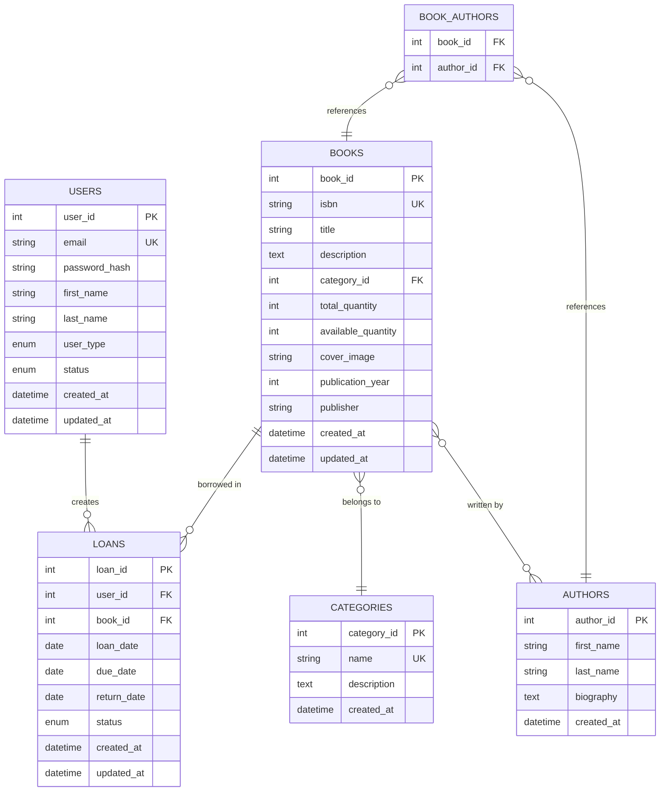
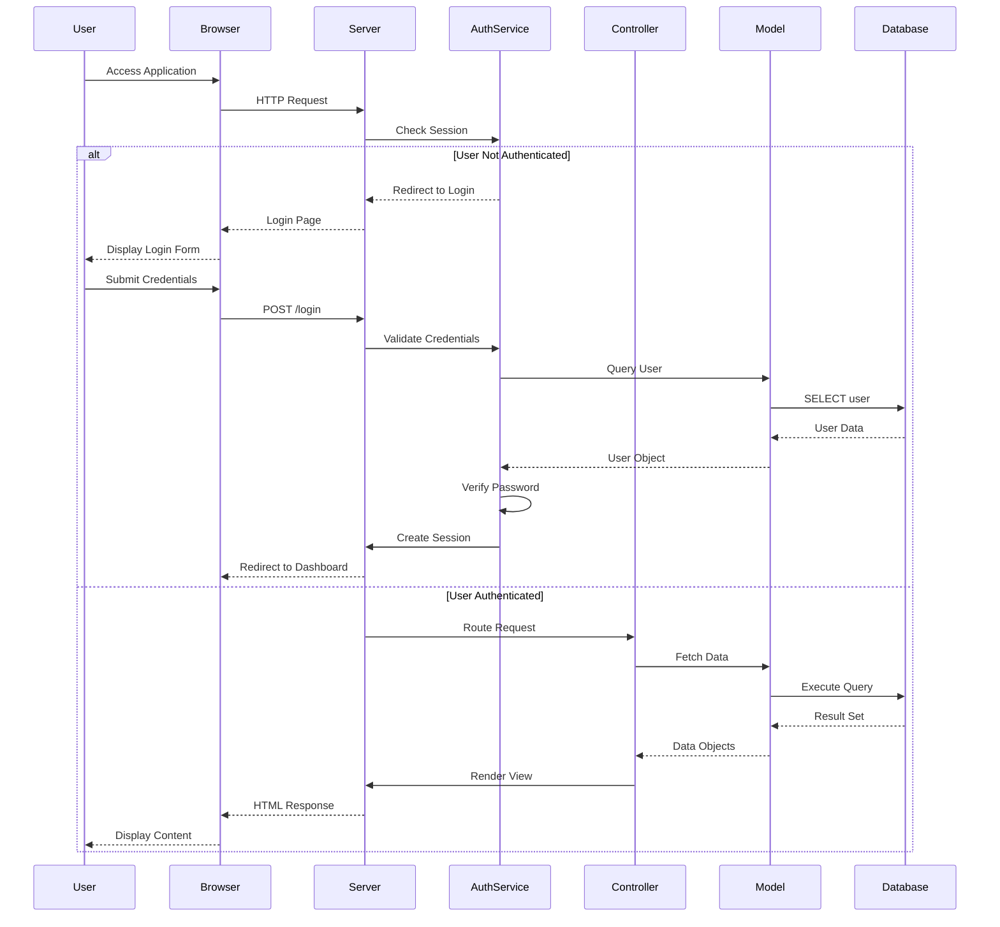
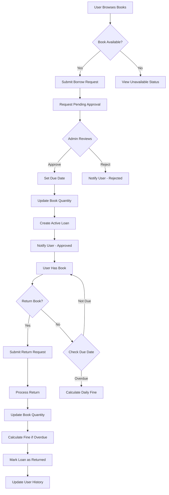

# KHLIBRARY - Library Management System

## Project Overview

KHLIBRARY is a comprehensive full-stack web application designed to streamline library operations and enhance user experience in book borrowing and management. The system provides a robust platform for managing book inventories, user accounts, loan transactions, and administrative oversight.

### Core Functionalities

- **User Management**: Role-based access control supporting administrators and patrons with distinct privileges
- **Book Catalog Management**: Comprehensive book inventory system with metadata, categorization, and availability tracking
- **Loan Processing**: Automated borrowing workflow with request submission, approval, and return mechanisms
- **Real-time Availability**: Dynamic book availability tracking with quantity management
- **Administrative Dashboard**: Centralized control panel for system oversight and reporting
- **Search and Discovery**: Advanced book search with filtering by title, author, and category
- **User Profile Management**: Self-service portal for viewing borrowed books and loan history

### System Capabilities

The application supports multi-user concurrent access, implements secure authentication mechanisms, and provides comprehensive audit trails for all transactions. The system enforces business rules including loan periods, overdue tracking, and fine calculations.

## Technology Stack

### Frontend Technologies

- **HTML5**: Semantic markup for structured content presentation
- **CSS3**: Modern styling with custom properties, flexbox, and grid layouts
- **JavaScript (ES6+)**: Client-side interactivity and asynchronous operations
- **Font Awesome 6.4.0**: Icon library for consistent visual elements

### Backend Technologies

- **PHP 7.4+**: Server-side scripting language for business logic implementation
- **MySQL 5.7+**: Relational database management system for data persistence
- **Apache HTTP Server**: Web server with mod_rewrite for URL routing

### Architecture Patterns

- **MVC (Model-View-Controller)**: Separation of concerns for maintainable codebase
- **RESTful API**: Standardized HTTP methods for resource manipulation
- **Service Layer Pattern**: Business logic encapsulation in dedicated service classes
- **Repository Pattern**: Data access abstraction through model classes

### Development Tools

- **Git**: Version control system for source code management
- **Hoppscotch**: API testing and documentation platform
- **Visual Studio Code**: Integrated development environment


## Application Architecture

### High-Level System Design

The application follows a three-tier architecture comprising presentation, application, and data layers. The presentation layer handles user interface rendering and client-side interactions. The application layer processes business logic through controllers and services. The data layer manages persistence through models and database abstraction.

### Component Interaction Flow

```
Client Browser → Apache Server → PHP Router → Controller → Service → Model → Database
                                      ↓
                                   View (PHP Templates)
```

### Directory Structure

```
the-robboeb-library/
├── api/                    # RESTful API endpoints
│   └── v1/
│       ├── controllers/    # API request handlers
│       └── index.php       # API router
├── config/                 # Configuration files
│   ├── constants.php       # Application constants
│   └── database.php        # Database configuration
├── database/               # SQL schema and migrations
├── logs/                   # Application error logs
├── public/                 # Publicly accessible files
│   ├── admin/             # Administrative interface
│   ├── assets/            # Static resources (CSS, JS, images)
│   ├── user/              # User interface
│   ├── browse.php         # Book catalog page
│   ├── login.php          # Authentication page
│   └── index.php          # Application entry point
└── src/                   # Application source code
    ├── controllers/       # Business logic controllers
    ├── helpers/           # Utility functions
    ├── middleware/        # Request/response interceptors
    ├── models/            # Data models and ORM
    └── services/          # Business service layer
```

### Security Architecture

- **Session Management**: Secure session handling with configurable timeout (1800 seconds)
- **Authentication Service**: Centralized authentication with role-based access control
- **Password Security**: Hashed password storage using bcrypt algorithm
- **SQL Injection Prevention**: Prepared statements with parameterized queries
- **XSS Protection**: Input sanitization and output escaping
- **CSRF Protection**: Token-based request validation for state-changing operations


## Database Schema and Entity Relationships

### Entity Relationship Diagram




### Application Workflow Sequence




### Book Borrowing Workflow




## User Flow Guide

### Public User Journey

#### 1. Initial Access
- User navigates to application URL
- System redirects to Browse Books page (homepage eliminated in redesign)
- Navigation bar displays: Browse Books, User Profile (if authenticated), Login/Logout

#### 2. Book Discovery
- User views book catalog in range-style grid layout
- Each book displays: cover image, title, author, availability status
- User can search by title or author
- User can filter by category
- Click on book card to view detailed information

#### 3. Authentication Flow
- Click Login button in navigation
- Enter email and password credentials
- System validates credentials
- Upon success, redirect to Browse Books or Admin Dashboard based on role
- Session created with 30-minute timeout

### Patron User Journey

#### 4. Book Borrowing Process
- Browse available books
- Click "Borrow" button on desired book
- Confirm borrowing request in dialog (displays 14-day loan period)
- Request submitted with "pending" status
- User redirected to profile to view pending requests

#### 5. Profile Management
- Navigate to User Profile from navigation bar
- View statistics: Currently Borrowed, Pending Requests, Overdue Books, Due Soon
- Pending Requests section displays books awaiting admin approval
- Currently Borrowed section shows active loans with:
  - Book cover, title, author
  - Borrowed date and due date
  - Days remaining or overdue status
  - Return button for each book

#### 6. Book Return Process
- In Currently Borrowed section, click "Return Book" button
- Confirm return action in dialog
- System processes return immediately
- Book quantity updated
- Loan marked as returned
- User receives success notification

