# KHLIBRARY - Library Management System

## Project Overview

KHLIBRARY is a comprehensive full-stack web application designed to streamline library operations and enhance user experience in book borrowing and management. The system provides a robust platform for managing book inventories, user accounts, loan transactions, and administrative oversight.

### Core Functionalities

- **User Management**: Role-based access control supporting administrators and patrons with distinct privileges
- **Book Catalog Management**: Comprehensive book inventory system with metadata, categorization, and availability tracking
- **Loan Processing**: Automated borrowing workflow with request submission, approval, and return mechanisms
- **Real-time Availability**: Dynamic book availability tracking with quantity management
- **Administrative Dashboard**: Centralized control panel for system oversight and reporting
- **Search and Discovery**: Advanced book search with filtering by title, author, and category
- **User Profile Management**: Self-service portal for viewing borrowed books and loan history

### System Capabilities

The application supports multi-user concurrent access, implements secure authentication mechanisms, and provides comprehensive audit trails for all transactions. The system enforces business rules including loan periods, overdue tracking, and fine calculations.

## Technology Stack

### Frontend Technologies

- **HTML5**: Semantic markup for structured content presentation
- **CSS3**: Modern styling with custom properties, flexbox, and grid layouts
- **JavaScript (ES6+)**: Client-side interactivity and asynchronous operations
- **Font Awesome 6.4.0**: Icon library for consistent visual elements

### Backend Technologies

- **PHP 7.4+**: Server-side scripting language for business logic implementation
- **MySQL 5.7+**: Relational database management system for data persistence
- **Apache HTTP Server**: Web server with mod_rewrite for URL routing

### Architecture Patterns

- **MVC (Model-View-Controller)**: Separation of concerns for maintainable codebase
- **RESTful API**: Standardized HTTP methods for resource manipulation
- **Service Layer Pattern**: Business logic encapsulation in dedicated service classes
- **Repository Pattern**: Data access abstraction through model classes

### Development Tools

- **Git**: Version control system for source code management
- **Hoppscotch**: API testing and documentation platform
- **Visual Studio Code**: Integrated development environment


## Application Architecture

### High-Level System Design

The application follows a three-tier architecture comprising presentation, application, and data layers. The presentation layer handles user interface rendering and client-side interactions. The application layer processes business logic through controllers and services. The data layer manages persistence through models and database abstraction.

### Component Interaction Flow

```
Client Browser → Apache Server → PHP Router → Controller → Service → Model → Database
                                      ↓
                                   View (PHP Templates)
```

### Directory Structure

```
the-robboeb-library/
├── api/                    # RESTful API endpoints
│   └── v1/
│       ├── controllers/    # API request handlers
│       └── index.php       # API router
├── config/                 # Configuration files
│   ├── constants.php       # Application constants
│   └── database.php        # Database configuration
├── database/               # SQL schema and migrations
├── logs/                   # Application error logs
├── public/                 # Publicly accessible files
│   ├── admin/             # Administrative interface
│   ├── assets/            # Static resources (CSS, JS, images)
│   ├── user/              # User interface
│   ├── browse.php         # Book catalog page
│   ├── login.php          # Authentication page
│   └── index.php          # Application entry point
└── src/                   # Application source code
    ├── controllers/       # Business logic controllers
    ├── helpers/           # Utility functions
    ├── middleware/        # Request/response interceptors
    ├── models/            # Data models and ORM
    └── services/          # Business service layer
```

### Security Architecture

- **Session Management**: Secure session handling with configurable timeout (1800 seconds)
- **Authentication Service**: Centralized authentication with role-based access control
- **Password Security**: Hashed password storage using bcrypt algorithm
- **SQL Injection Prevention**: Prepared statements with parameterized queries
- **XSS Protection**: Input sanitization and output escaping
- **CSRF Protection**: Token-based request validation for state-changing operations


## Database Schema and Entity Relationships

### Entity Relationship Diagram

```mermaid
erDiagram
    USERS ||--o{ LOANS : creates
    BOOKS ||--o{ LOANS : "borrowed in"
    BOOKS }o--|| CATEGORIES : "belongs to"
    BOOKS }o--o{ AUTHORS : "written by"
    BOOK_AUTHORS }o--|| BOOKS : references
    BOOK_AUTHORS }o--|| AUTHORS : references

    USERS {
        int user_id PK
        string email UK
        string password_hash
        string first_name
        string last_name
        enum user_type
        enum status
        datetime created_at
        datetime updated_at
    }

    BOOKS {
        int book_id PK
        string isbn UK
        string title
        text description
        int category_id FK
        int total_quantity
        int available_quantity
        string cover_image
        int publication_year
        string publisher
        datetime created_at
        datetime updated_at
    }

    AUTHORS {
        int author_id PK
        string first_name
        string last_name
        text biography
        datetime created_at
    }

    CATEGORIES {
        int category_id PK
        string name UK
        text description
        datetime created_at
    }

    LOANS {
        int loan_id PK
        int user_id FK
        int book_id FK
        date loan_date
        date due_date
        date return_date
        enum status
        datetime created_at
        datetime updated_at
    }

    BOOK_AUTHORS {
        int book_id FK
        int author_id FK
    }
```




### Application Workflow Sequence


### Book Borrowing Workflow


## User Flow Guide

### Public User Journey

#### 1. Initial Access
- User navigates to application URL
- System redirects to Browse Books page (homepage eliminated in redesign)
- Navigation bar displays: Browse Books, User Profile (if authenticated), Login/Logout

#### 2. Book Discovery
- User views book catalog in range-style grid layout
- Each book displays: cover image, title, author, availability status
- User can search by title or author
- User can filter by category
- Click on book card to view detailed information

#### 3. Authentication Flow
- Click Login button in navigation
- Enter email and password credentials
- System validates credentials
- Upon success, redirect to Browse Books or Admin Dashboard based on role
- Session created with 30-minute timeout

### Patron User Journey

#### 4. Book Borrowing Process
- Browse available books
- Click "Borrow" button on desired book
- Confirm borrowing request in dialog (displays 14-day loan period)
- Request submitted with "pending" status
- User redirected to profile to view pending requests

#### 5. Profile Management
- Navigate to User Profile from navigation bar
- View statistics: Currently Borrowed, Pending Requests, Overdue Books, Due Soon
- Pending Requests section displays books awaiting admin approval
- Currently Borrowed section shows active loans with:
  - Book cover, title, author
  - Borrowed date and due date
  - Days remaining or overdue status
  - Return button for each book

#### 6. Book Return Process
- In Currently Borrowed section, click "Return Book" button
- Confirm return action in dialog
- System processes return immediately
- Book quantity updated
- Loan marked as returned
- User receives success notification

### Administrator Journey

#### 7. Admin Dashboard Access
- Login with admin credentials
- Redirected to Admin Dashboard
- View system statistics: Total Books, Active Members, Active Loans, Categories
- Access sidebar navigation for all management functions

#### 8. Loan Management
- Navigate to Loans Management
- View pending loan requests
- Review request details (user, book, requested date)
- Approve request: Set due date (default 14 days)
- Reject request: Provide reason
- View active loans with overdue tracking
- Process returns (admin-initiated)

#### 9. Book Management
- Navigate to Books Management
- Add new books with metadata (title, ISBN, author, category, quantity, cover image)
- Edit existing book information
- Delete books (if no active loans)
- Manage book quantities
- Upload cover images

#### 10. User Management
- Navigate to Users Management
- View all registered users
- Create new user accounts
- Edit user information
- Change user roles (patron/admin)
- Activate/deactivate accounts

---

## Frontend Documentation

### Page Structure

#### 1. Browse Books (`public/browse.php`)

**Purpose**: Main landing page for book discovery and browsing

**Features**:
- Range-style grid layout with full book covers
- Search functionality (title, author)
- Category filtering
- Availability badges
- Quick borrow/view actions
- Responsive design (auto-fill grid)

**UI Components**:
```html
<!-- Navigation Bar -->
<nav class="navbar">
  - Logo and brand name
  - Browse Books link (active)
  - User Profile link
  - Logout button
</nav>

<!-- Search Section -->
<div class="search-section">
  - Search input (text)
  - Category dropdown
  - Search button
</div>

<!-- Books Grid -->
<div class="books-range">
  - Book cards (200px × 300px covers)
  - Availability badge
  - Title and author
  - Borrow/View buttons
</div>
```

**JavaScript Functions**:
- `viewDetails(bookId)` - Navigate to book detail page
- `requestBorrow(bookId, bookTitle)` - Submit borrow request
- `showNotification(message, type)` - Display toast notification
- `logout()` - End user session

#### 2. User Profile (`public/user/profile.php`)

**Purpose**: User dashboard for managing borrowed books and viewing statistics

**Features**:
- Profile header with avatar and user info
- Statistics cards (4 metrics)
- Pending requests section
- Currently borrowed books list
- One-click return functionality
- Status color coding (overdue/due soon/active)

**UI Components**:
```html
<!-- Profile Header -->
<div class="profile-header">
  - Avatar circle with initial
  - User name and email
  - Member since date
</div>

<!-- Statistics Grid -->
<div class="stats-grid">
  - Currently Borrowed count
  - Pending Requests count
  - Overdue Books count
  - Due Soon count (3 days)
</div>

<!-- Pending Requests -->
<div class="section">
  - Book cover thumbnail
  - Title and author
  - Status: "Waiting for admin approval"
</div>

<!-- Currently Borrowed -->
<div class="section">
  - Book cover thumbnail
  - Title and author
  - Borrowed date and due date
  - Days remaining/overdue
  - Return button
</div>
```

**JavaScript Functions**:
- `returnBook(loanId, bookTitle)` - Submit return request
- `showNotification(message, type)` - Display toast notification
- `logout()` - End user session

#### 3. Book Detail (`public/book-detail.php`)

**Purpose**: Detailed view of individual book information

**Features**:
- Large book cover display
- Complete book metadata
- Author biography
- Category information
- Availability status
- Borrow button (if available)

#### 4. Login Page (`public/login.php`)

**Purpose**: User authentication interface

**Features**:
- Email and password inputs
- Remember me checkbox
- Login button
- Back to Browse Books link
- Error message display

### CSS Architecture

#### Brand Colors
```css
/* Primary Colors */
--primary-orange: #ff5722;
--deep-orange: #ee3900;
--light-orange: #ff7e55;

/* Neutral Colors */
--background: #f5f5f5;
--white: #ffffff;
--dark: #212121;
--medium-gray: #616161;
--light-gray: #757575;

/* Status Colors */
--success: #2e7d32;
--warning: #ef6c00;
--error: #c62828;
```

#### Responsive Breakpoints
```css
/* Mobile */
@media (max-width: 768px) {
  - Stacked layouts
  - Hamburger menu
  - Full-width cards
}

/* Desktop */
@media (min-width: 769px) {
  - Grid layouts
  - Horizontal navigation
  - Multi-column displays
}
```

#### Component Styles

**Navigation Bar**:
- Height: 70px
- Background: #ffffff
- Border: 3px solid #ff5722
- Shadow: 0 2px 12px rgba(0,0,0,0.1)
- Position: sticky top

**Book Cards**:
- Border radius: 12px
- Shadow: 0 2px 8px rgba(0,0,0,0.08)
- Hover: translateY(-6px) + shadow increase
- Border: 1px solid #f5f5f5

**Buttons**:
- Primary: #ff5722 background, white text
- Secondary: #f5f5f5 background, #424242 text
- Border radius: 8px
- Padding: 10px 20px
- Transition: 0.2s ease

### JavaScript Utilities

#### API Communication
```javascript
// Fetch wrapper for API calls
fetch(BASE_URL + '/api/v1/endpoint', {
    method: 'POST',
    headers: {
        'Content-Type': 'application/json',
        'Accept': 'application/json'
    },
    credentials: 'same-origin',
    body: JSON.stringify(data)
})
.then(response => response.json())
.then(data => {
    if (data.success) {
        // Handle success
    } else {
        // Handle error
    }
})
.catch(error => {
    // Handle network error
});
```

#### Notification System
```javascript
function showNotification(message, type) {
    // type: 'success', 'error', 'info'
    // Creates toast notification
    // Auto-dismisses after 3 seconds
    // Slide-in/slide-out animations
}
```

---

## Backend API Documentation

### API Base URL
```
http://localhost/the-robboeb-library/api/v1
```

### Authentication
All API endpoints require session-based authentication. Include credentials in requests:
```javascript
credentials: 'same-origin'
```

### Response Format
All API responses follow this structure:
```json
{
    "success": true,
    "data": { ... },
    "message": "Operation successful",
    "error": null
}
```

Error responses:
```json
{
    "success": false,
    "data": null,
    "message": "Error description",
    "error": {
        "code": "ERROR_CODE",
        "message": "Detailed error message"
    }
}
```

---

## API Endpoints Reference

### Authentication Endpoints

#### POST /api/v1/auth/login
**Description**: Authenticate user and create session

**Request Body**:
```json
{
    "email": "user@example.com",
    "password": "password123"
}
```

**Response** (200 OK):
```json
{
    "success": true,
    "data": {
        "user_id": 1,
        "email": "user@example.com",
        "first_name": "John",
        "last_name": "Doe",
        "user_type": "patron"
    },
    "message": "Login successful"
}
```

**Errors**:
- 400: Invalid credentials
- 401: Account inactive
- 422: Validation error

---

#### POST /api/v1/auth/logout
**Description**: End user session

**Response** (200 OK):
```json
{
    "success": true,
    "message": "Logout successful",
    "redirect": "/public/browse.php"
}
```

---

### Book Endpoints

#### GET /api/v1/books
**Description**: Retrieve list of books with optional filtering

**Query Parameters**:
- `search` (string): Search by title or author
- `category_id` (int): Filter by category
- `available_only` (boolean): Show only available books
- `limit` (int): Number of results (default: 1000)
- `offset` (int): Pagination offset (default: 0)

**Response** (200 OK):
```json
{
    "success": true,
    "data": {
        "books": [
            {
                "book_id": 1,
                "isbn": "978-0-123456-78-9",
                "title": "Sample Book Title",
                "description": "Book description...",
                "category_id": 1,
                "category_name": "Fiction",
                "author_name": "John Smith",
                "total_quantity": 5,
                "available_quantity": 3,
                "cover_image": "https://example.com/cover.jpg",
                "publication_year": 2023,
                "publisher": "Publisher Name",
                "created_at": "2025-01-01 10:00:00"
            }
        ],
        "count": 1
    }
}
```

---

#### GET /api/v1/books/{id}
**Description**: Retrieve single book details

**Response** (200 OK):
```json
{
    "success": true,
    "data": {
        "book_id": 1,
        "isbn": "978-0-123456-78-9",
        "title": "Sample Book Title",
        "description": "Detailed book description...",
        "category_id": 1,
        "category_name": "Fiction",
        "author_name": "John Smith",
        "author_bio": "Author biography...",
        "total_quantity": 5,
        "available_quantity": 3,
        "cover_image": "https://example.com/cover.jpg",
        "publication_year": 2023,
        "publisher": "Publisher Name"
    }
}
```

**Errors**:
- 404: Book not found

---

#### POST /api/v1/books (Admin Only)
**Description**: Create new book

**Request Body**:
```json
{
    "isbn": "978-0-123456-78-9",
    "title": "New Book Title",
    "description": "Book description",
    "category_id": 1,
    "author_id": 1,
    "total_quantity": 5,
    "cover_image": "https://example.com/cover.jpg",
    "publication_year": 2023,
    "publisher": "Publisher Name"
}
```

**Response** (201 Created):
```json
{
    "success": true,
    "data": {
        "book_id": 10,
        "isbn": "978-0-123456-78-9",
        "title": "New Book Title"
    },
    "message": "Book created successfully"
}
```

**Errors**:
- 400: Validation error
- 403: Permission denied
- 409: ISBN already exists

---

#### PUT /api/v1/books/{id} (Admin Only)
**Description**: Update book information

**Request Body**: Same as POST (partial updates allowed)

**Response** (200 OK):
```json
{
    "success": true,
    "data": {
        "book_id": 1,
        "title": "Updated Title"
    },
    "message": "Book updated successfully"
}
```

---

#### DELETE /api/v1/books/{id} (Admin Only)
**Description**: Delete book (only if no active loans)

**Response** (200 OK):
```json
{
    "success": true,
    "message": "Book deleted successfully"
}
```

**Errors**:
- 400: Book has active loans
- 404: Book not found

---

### Loan Endpoints

#### GET /api/v1/loans
**Description**: Retrieve loans (admin sees all, patrons see own)

**Query Parameters**:
- `user_id` (int): Filter by user (admin only)
- `status` (string): Filter by status (active, overdue, returned, pending, rejected)
- `limit` (int): Number of results
- `offset` (int): Pagination offset

**Response** (200 OK):
```json
{
    "success": true,
    "data": {
        "loans": [
            {
                "loan_id": 1,
                "user_id": 5,
                "user_name": "John Doe",
                "user_email": "john@example.com",
                "book_id": 10,
                "book_title": "Sample Book",
                "isbn": "978-0-123456-78-9",
                "cover_image": "https://example.com/cover.jpg",
                "loan_date": "2025-11-01",
                "due_date": "2025-11-15",
                "return_date": null,
                "status": "borrowed",
                "loan_status": "active",
                "fine_amount": 0,
                "created_at": "2025-11-01 10:00:00"
            }
        ],
        "count": 1
    }
}
```

---

#### GET /api/v1/loans/my
**Description**: Get current user's loans

**Query Parameters**:
- `status` (string): Filter by status

**Response**: Same as GET /api/v1/loans

---

#### GET /api/v1/loans/{id}
**Description**: Get single loan details

**Response** (200 OK):
```json
{
    "success": true,
    "data": {
        "loan_id": 1,
        "user_id": 5,
        "book_id": 10,
        "book_title": "Sample Book",
        "loan_date": "2025-11-01",
        "due_date": "2025-11-15",
        "return_date": null,
        "status": "borrowed",
        "fine_amount": 0
    }
}
```

**Errors**:
- 403: Cannot view other user's loans (patrons)
- 404: Loan not found

---

#### POST /api/v1/loans/request
**Description**: Request to borrow a book (patron)

**Request Body**:
```json
{
    "book_id": 10
}
```

**Response** (201 Created):
```json
{
    "success": true,
    "data": {
        "loan_id": 15,
        "book_id": 10,
        "user_id": 5,
        "status": "pending",
        "created_at": "2025-11-18 14:30:00"
    },
    "message": "Borrow request submitted successfully"
}
```

**Errors**:
- 400: Book not available
- 400: User already has pending request for this book
- 400: User already borrowed this book
- 404: Book not found

---

#### PUT /api/v1/loans/{id}/approve (Admin Only)
**Description**: Approve pending loan request

**Request Body**:
```json
{
    "due_date": "2025-12-02"
}
```

**Response** (200 OK):
```json
{
    "success": true,
    "data": {
        "loan_id": 15,
        "status": "borrowed",
        "loan_date": "2025-11-18",
        "due_date": "2025-12-02"
    },
    "message": "Loan approved successfully"
}
```

**Errors**:
- 400: Loan not in pending status
- 400: Book not available
- 400: Invalid due date

---

#### PUT /api/v1/loans/{id}/reject (Admin Only)
**Description**: Reject pending loan request

**Response** (200 OK):
```json
{
    "success": true,
    "data": {
        "loan_id": 15,
        "status": "rejected"
    },
    "message": "Loan rejected successfully"
}
```

---

#### POST /api/v1/loans/{id}/return
**Description**: Return borrowed book (user can return own books)

**Response** (200 OK):
```json
{
    "success": true,
    "data": {
        "loan_id": 15,
        "return_date": "2025-11-20",
        "status": "returned",
        "fine_amount": 0
    },
    "message": "Book returned successfully"
}
```

**Errors**:
- 400: Loan not in borrowed status
- 403: Cannot return other user's books
- 404: Loan not found

---

#### PUT /api/v1/loans/{id}/return (Admin Only)
**Description**: Process book return (admin-initiated)

**Response**: Same as POST /api/v1/loans/{id}/return

---

#### GET /api/v1/loans/overdue (Admin Only)
**Description**: Get all overdue loans

**Response** (200 OK):
```json
{
    "success": true,
    "data": {
        "loans": [
            {
                "loan_id": 10,
                "user_name": "John Doe",
                "book_title": "Sample Book",
                "due_date": "2025-11-10",
                "days_overdue": 8,
                "fine_amount": 8.00
            }
        ],
        "count": 1
    }
}
```

---

#### GET /api/v1/loans/pending (Admin Only)
**Description**: Get all pending loan requests

**Response** (200 OK):
```json
{
    "success": true,
    "data": {
        "loans": [
            {
                "loan_id": 15,
                "user_name": "Jane Smith",
                "book_title": "Sample Book",
                "created_at": "2025-11-18 14:30:00"
            }
        ],
        "count": 1
    }
}
```

---

### User Endpoints

#### GET /api/v1/users (Admin Only)
**Description**: Retrieve list of users

**Query Parameters**:
- `user_type` (string): Filter by type (admin, patron)
- `status` (string): Filter by status (active, inactive)
- `limit` (int): Number of results
- `offset` (int): Pagination offset

**Response** (200 OK):
```json
{
    "success": true,
    "data": {
        "users": [
            {
                "user_id": 5,
                "email": "john@example.com",
                "first_name": "John",
                "last_name": "Doe",
                "user_type": "patron",
                "status": "active",
                "created_at": "2025-01-15 10:00:00"
            }
        ],
        "count": 1
    }
}
```

---

#### GET /api/v1/users/{id} (Admin Only)
**Description**: Get single user details

**Response** (200 OK):
```json
{
    "success": true,
    "data": {
        "user_id": 5,
        "email": "john@example.com",
        "first_name": "John",
        "last_name": "Doe",
        "user_type": "patron",
        "status": "active",
        "created_at": "2025-01-15 10:00:00",
        "updated_at": "2025-11-18 10:00:00"
    }
}
```

---

#### POST /api/v1/users (Admin Only)
**Description**: Create new user

**Request Body**:
```json
{
    "email": "newuser@example.com",
    "password": "SecurePass123!",
    "first_name": "Jane",
    "last_name": "Smith",
    "user_type": "patron"
}
```

**Response** (201 Created):
```json
{
    "success": true,
    "data": {
        "user_id": 20,
        "email": "newuser@example.com",
        "first_name": "Jane",
        "last_name": "Smith"
    },
    "message": "User created successfully"
}
```

**Errors**:
- 400: Validation error
- 409: Email already exists

---

#### PUT /api/v1/users/{id} (Admin Only)
**Description**: Update user information

**Request Body**: Same as POST (partial updates allowed)

**Response** (200 OK):
```json
{
    "success": true,
    "data": {
        "user_id": 5,
        "email": "updated@example.com"
    },
    "message": "User updated successfully"
}
```

---

#### DELETE /api/v1/users/{id} (Admin Only)
**Description**: Delete user (only if no active loans)

**Response** (200 OK):
```json
{
    "success": true,
    "message": "User deleted successfully"
}
```

**Errors**:
- 400: User has active loans
- 404: User not found

---

### Category Endpoints

#### GET /api/v1/categories
**Description**: Retrieve all categories

**Response** (200 OK):
```json
{
    "success": true,
    "data": {
        "categories": [
            {
                "category_id": 1,
                "name": "Fiction",
                "description": "Fictional literature",
                "book_count": 25,
                "created_at": "2025-01-01 10:00:00"
            }
        ],
        "count": 1
    }
}
```

---

#### POST /api/v1/categories (Admin Only)
**Description**: Create new category

**Request Body**:
```json
{
    "name": "Science Fiction",
    "description": "Science fiction books"
}
```

**Response** (201 Created):
```json
{
    "success": true,
    "data": {
        "category_id": 10,
        "name": "Science Fiction"
    },
    "message": "Category created successfully"
}
```

---

### Author Endpoints

#### GET /api/v1/authors
**Description**: Retrieve all authors

**Response** (200 OK):
```json
{
    "success": true,
    "data": {
        "authors": [
            {
                "author_id": 1,
                "first_name": "John",
                "last_name": "Smith",
                "biography": "Author biography...",
                "book_count": 5,
                "created_at": "2025-01-01 10:00:00"
            }
        ],
        "count": 1
    }
}
```

---

#### POST /api/v1/authors (Admin Only)
**Description**: Create new author

**Request Body**:
```json
{
    "first_name": "Jane",
    "last_name": "Doe",
    "biography": "Author biography..."
}
```

**Response** (201 Created):
```json
{
    "success": true,
    "data": {
        "author_id": 15,
        "first_name": "Jane",
        "last_name": "Doe"
    },
    "message": "Author created successfully"
}
```

---

## Installation Guide

### Prerequisites
- PHP 7.4 or higher
- MySQL 5.7 or higher
- Apache HTTP Server with mod_rewrite enabled
- Git (for version control)

### Installation Steps

1. **Clone Repository**
```bash
git clone https://github.com/robboeb/the-robboeb-library.git
cd the-robboeb-library
```

2. **Configure Database**
```bash
# Create database
mysql -u root -p
CREATE DATABASE library_db;
exit;

# Import schema
mysql -u root -p library_db < database/schema.sql
```

3. **Update Configuration**
Edit `config/database.php`:
```php
define('DB_HOST', 'localhost');
define('DB_NAME', 'library_db');
define('DB_USER', 'your_username');
define('DB_PASS', 'your_password');
```

Edit `config/constants.php`:
```php
define('BASE_URL', '/the-robboeb-library');
define('APP_NAME', 'KHLIBRARY');
```

4. **Set Permissions**
```bash
chmod 755 public/
chmod 755 logs/
chmod 644 config/*.php
```

5. **Configure Apache**
Ensure `.htaccess` is enabled and mod_rewrite is active:
```apache
<Directory "/path/to/the-robboeb-library">
    AllowOverride All
    Require all granted
</Directory>
```

6. **Access Application**
Navigate to: `http://localhost/the-robboeb-library`

### Default Admin Account
```
Email: admin@library.com
Password: admin123
```

**⚠️ Change default password immediately after first login!**

---

## Development Guidelines

### Code Standards
- Follow PSR-12 coding standards for PHP
- Use meaningful variable and function names
- Comment complex logic
- Keep functions small and focused
- Use prepared statements for all database queries

### Git Workflow
```bash
# Create feature branch
git checkout -b feature/new-feature

# Make changes and commit
git add .
git commit -m "Add new feature"

# Push to repository
git push origin feature/new-feature

# Create pull request for review
```

### Testing
- Test all API endpoints with Hoppscotch or Postman
- Verify user flows in different browsers
- Test responsive design on mobile devices
- Check error handling and validation
- Verify security measures (authentication, authorization)

---

## Troubleshooting

### Common Issues

**Issue**: Database connection error
**Solution**: Verify database credentials in `config/database.php`

**Issue**: 404 errors on all pages
**Solution**: Enable mod_rewrite in Apache and check `.htaccess` file

**Issue**: Session timeout too short
**Solution**: Adjust `SESSION_TIMEOUT` in `config/constants.php`

**Issue**: Book covers not displaying
**Solution**: Check image URLs and ensure external images are accessible

**Issue**: API returns 403 Forbidden
**Solution**: Verify user is authenticated and has proper permissions

---

## Security Best Practices

### Implemented Security Measures
- ✅ Password hashing with bcrypt
- ✅ Prepared statements (SQL injection prevention)
- ✅ Input validation and sanitization
- ✅ Output escaping (XSS prevention)
- ✅ Session management with timeout
- ✅ Role-based access control
- ✅ HTTPS recommended for production

### Recommendations
- Use HTTPS in production
- Implement rate limiting for API endpoints
- Regular security audits
- Keep dependencies updated
- Monitor error logs
- Implement CSRF tokens for forms
- Use environment variables for sensitive data

---

## Performance Optimization

### Database
- Indexed columns: user_id, book_id, email, isbn
- Optimized queries with JOINs
- Connection pooling
- Query result caching (recommended)

### Frontend
- Minified CSS and JavaScript (recommended)
- Image optimization
- CDN for static assets (Font Awesome, logo)
- Lazy loading for images (recommended)
- Browser caching headers

### Backend
- Efficient query design
- Pagination for large datasets
- Session storage optimization
- Error logging without performance impact

---

## Contributing

### How to Contribute
1. Fork the repository
2. Create feature branch
3. Make changes with tests
4. Submit pull request
5. Wait for code review

### Contribution Guidelines
- Follow existing code style
- Write clear commit messages
- Add comments for complex logic
- Update documentation
- Test thoroughly before submitting

---

## License

This project is licensed under the MIT License - see the LICENSE file for details.

---

## Credits

**Developer**: eirsvi.t.me  
**Contact**: https://t.me/eirsvi  
**Repository**: https://github.com/robboeb/the-robboeb-library  
**Version**: 2.0  
**Last Updated**: November 18, 2025

---

## Support

For issues, questions, or suggestions:
- Open an issue on GitHub
- Contact developer via Telegram: https://t.me/eirsvi
- Email: info@khlibrary.com

---

## Changelog

### Version 2.0 (November 18, 2025)
- ✅ Complete frontend redesign
- ✅ Eliminated homepage
- ✅ Range-style book layout
- ✅ Unified navigation (2 items)
- ✅ User self-return functionality
- ✅ Brand color theme implementation
- ✅ Improved color contrast (WCAG 2.1 AA)
- ✅ Added favicon to all pages
- ✅ Developer credits in footer
- ✅ Fixed UI bugs and stray symbols
- ✅ Enhanced API with user return endpoint
- ✅ Comprehensive documentation

### Version 1.0 (Initial Release)
- Basic library management system
- Admin and patron roles
- Book catalog management
- Loan processing
- User management
- Search and filtering

---

**© 2025 KHLIBRARY. All rights reserved.**

